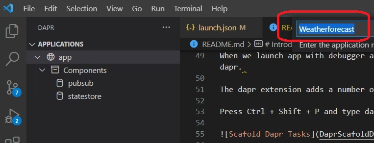

# Introduction 

Dapr Example

## Dpr0002000
This is taken from 
https://www.youtube.com/watch?v=OtbYCBt9C34

https://youtu.be/OtbYCBt9C34?t=183

dotnet new webapi --no-https --name 

> Running the app.

1. dotnet restore
2. dotnet build
3. dotnet run

To access the app

1. http://localhost:5073/swagger/index.html
2. http://localhost:5073/WeatherForecast

To Stop the app, Ctrl + C

> Running the app using vs code lauch configuration

1. Open a command prompt in this folder(where the cs proj file is present.)
2. execute **code . -r** command. This ensures vs code is started in that folder.

Now select the debug tab(Ctrl + Shift + D) from activity bar.

From the drop down select a launch configuration and click the green triangle play button.

.

If you look at the launch configuration, there are compounds as well. This coupound will enable launching two or more launch configs at one time.

> Now launching with dapr

Take a look at [this video](https://youtu.be/OtbYCBt9C34?t=108).

There is a [dapr extension for VsCode](https://marketplace.visualstudio.com/items?itemName=ms-azuretools.vscode-dapr). 

Using this extension, you can add vs code launch configurations that will enable to debug the app in the context of dapr. 

When we launch app with debugger attached to this app, we also want to start the dapr side car so that we can make calls to our app through dapr. 

The dapr extension adds a number of new commands, available through command platted(Ctrl + Shift + P)

Press Ctrl + Shift + P and type dapr

.

.NET Core Launch (web) with Dapr

http://localhost:<port-no>/v1.0/invoke/<app-id>/method/<method-name

Place a break point in Controller.

Select Dapr tab on the activity bar. Then rightclick the app and then do get or post.

To open the dashboard, use the dapr extension command platte. Type dapr show dashboard

.

Type the url here.

.
