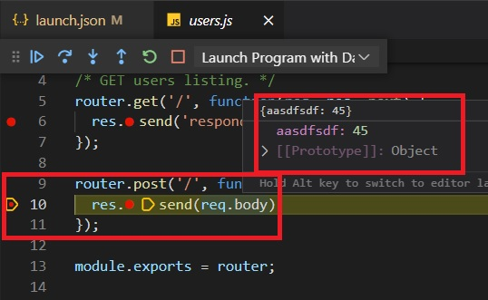

# Introduction 

Dapr Example

>This demonistrates how to debug a dapr node app but within the context of dapr.

## Dpr0002010
This is taken from 

https://www.youtube.com/watch?v=OtbYCBt9C34

https://youtu.be/OtbYCBt9C34?t=183

npx express-generator .

npm install

npm start

Browse to http://localhost:3001/

Add the following in users.js file.

```js
router.post('/', function(req, res, next){
  res.send(req.body);
});
```

In the activity bar, select debug tab(Ctrl + Shift + D) and create a launch.json file.
Select Node.js lauch configuration. 

Start the debugging.
Place a break point in users get method and then browse to http://localhost:3001/users

To add more launch configurations.
In the command pallatte, select Debug: Open link


To add dapr launch confguration
In the command palette, select Dapr:Scaffold Dapr Tasks.
This will create additional launch configuration and also adds tasks.

Now to debug in the dapr context, do ensure docker desktop is running. 
Also dapr is initialized by running **dapr init**

Now select the "Launch Program with Dapr"
Once the app is running in dapr context, dapr tab in the activity bar.
Ensure your application is running. Right click it and invoke get application method, for users endpoint.
Then invoke the post application. For json payload you can use 
{
    "number": 1234
}

The events stuff is not working.
https://youtu.be/OtbYCBt9C34?t=757

The format of the dapr uri

http://localhost:<port-no>/v1.0/invoke/<app-id>/method/<method-name>

.

Invoke

.


Debugger

